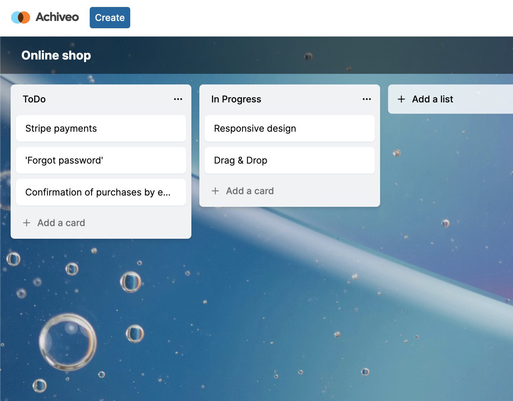

Achiveo is a Trello clone with additional features such as workspaces, boards, lists, cards, audit logs/activity tracking, and member roles. This project for example utilizes various technologies including PostgreSQL, Prisma ORM, shadcnUI, TailwindCSS, and integrates with the Unsplash API for fetching beautiful cover images.

## Demo

https://achiveo.vercel.app/

## Tech Stack


[](https://nextjs.org/)
[](https://clerk.dev/)
[](https://www.prisma.io/)
[](https://react-query.tanstack.com/)
[](https://lodash.com/)
[](https://stripe.com/)
[](https://www.npmjs.com/package/zod)
[](https://www.npmjs.com/package/zustand)
[](https://usehooks-ts.com/)
[](https://date-fns.org/)
[](https://github.com/unsplash/unsplash-js)
[](https://github.com/shadcnUI)
[](https://tailwindcss.com/)
[](https://github.com/benjick/sonner)
[](https://github.com/hello-pangea/dnd)


## Features

- Auth 
- Organizations / Workspaces
- Board creation
- Responsive
- Unsplash API for random cover images
- Activity log for entire organization
- Board rename and delete
- List creation / delete / rename / duplicate
- List and card Drag & drop reorder
- Card creation / delete / rename / duplicate / 
- Card activity log
- Board limit for every organization
- Stripe subscription for each organization to unlock unlimited boards
- Landing page
- PosgreSQL DB
- Prisma ORM
- shadcnUI & TailwindCSS


## Run Locally

Clone the project

```bash
  git clone https://github.com/waleery/trello-clone
```

Go to the project directory

```bash
  cd trello-clone
```

Install dependencies

```bash
  npm install
```

### Setup .env file

To run this project, you will need to add the following environment variables to your .env file
```js
NEXT_PUBLIC_CLERK_PUBLISHABLE_KEY=
CLERK_SECRET_KEY=
NEXT_PUBLIC_CLERK_SIGN_IN_URL=
NEXT_PUBLIC_CLERK_SIGN_UP_URL=
NEXT_PUBLIC_CLERK_AFTER_SIGN_IN_URL=
NEXT_PUBLIC_CLERK_AFTER_SIGN_UP_URL=

DATABASE_URL=

NEXT_PUBLIC_UNSPLASH_ACCESS_KEY=

STRIPE_API_KEY=

NEXT_PUBLIC_APP_URL=

STRIPE_WEBHOOK_SECRET=
```
### Setup Prisma

Add PostgreSQL Database (I used Supabase)

```shell
npx prisma generate
npx prisma db push

```

### Start the app

```shell
npm run dev
```


## Screenshots


